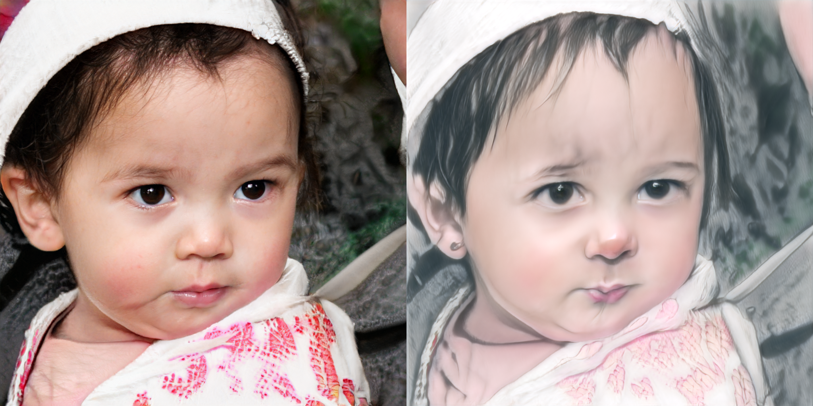
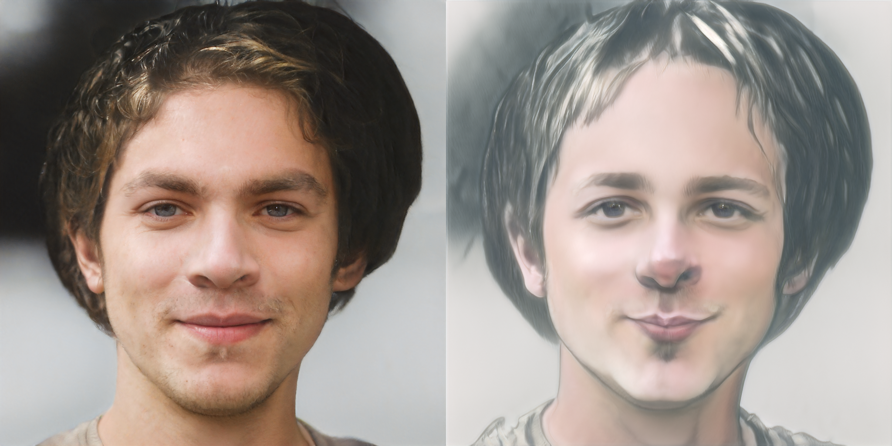
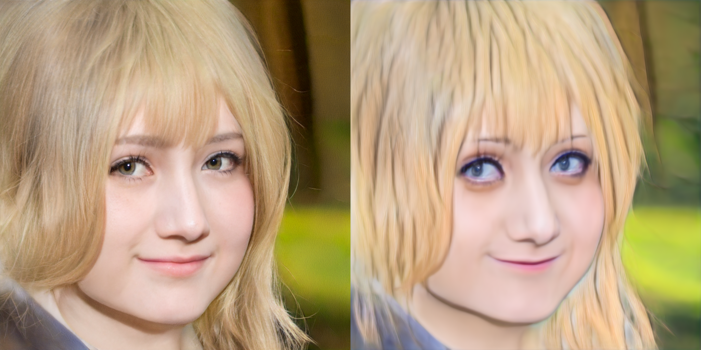
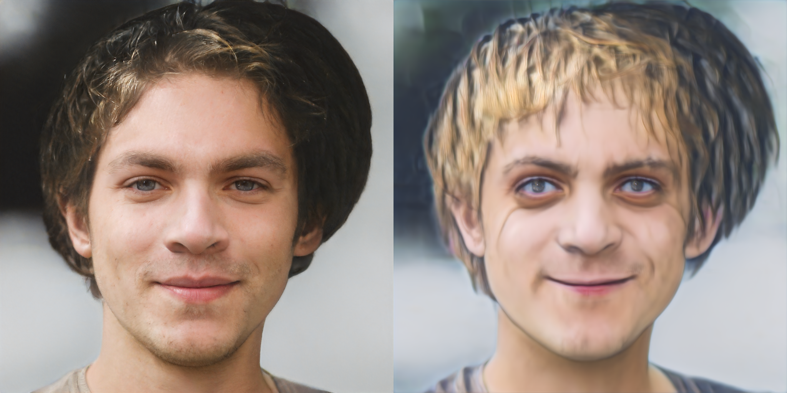
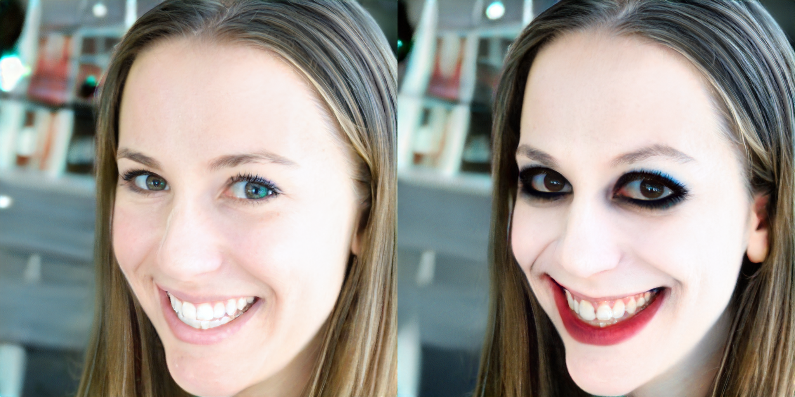
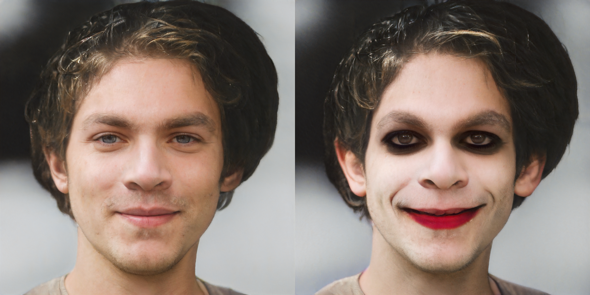

# StyleGAN-NADA-DLS
Реимплементация StyleGAN-NADA в качестве дипломного проекта для Deep Learning School (1-й семестр, весна 2025).
https://colab.research.google.com/drive/1UUAuVIstGxMJr44uyVV8E8bj7F5TtZyC?usp=sharing

Примеры работы (слева сгенерированная картинка, справа - инвертированное реальное фото из фотостока):
-photo -> sketch

  
  

-photo -> anime

  
  

-human -> Joker

  
  

-human -> Nicolas Cage

  
  

