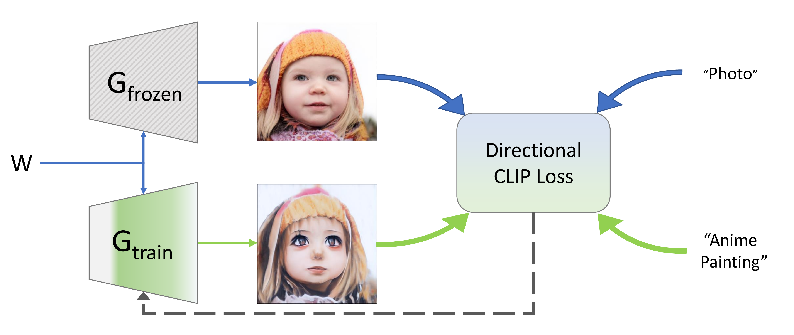
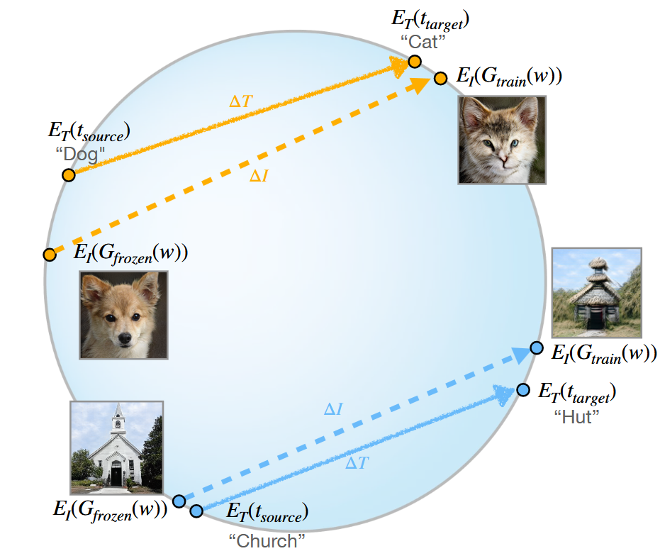
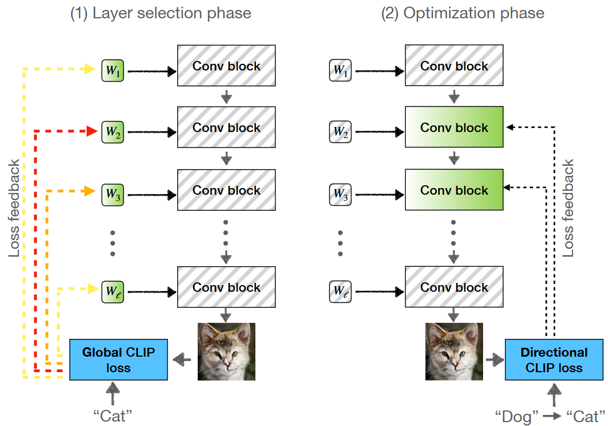
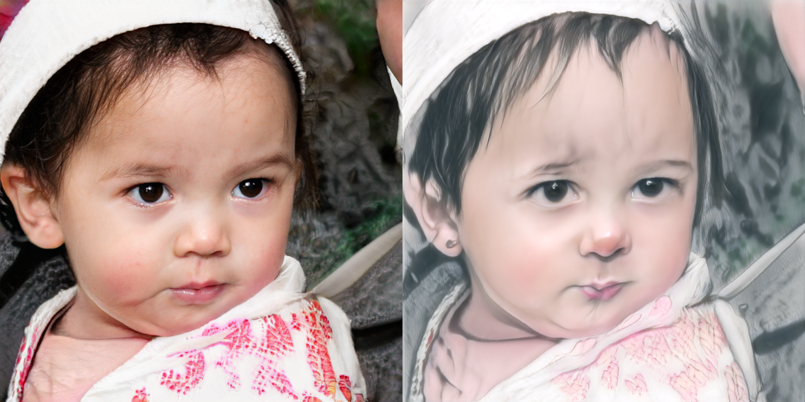
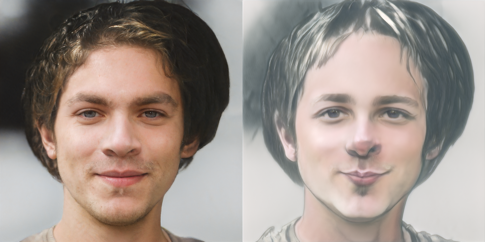
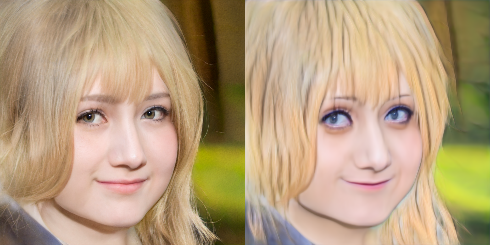
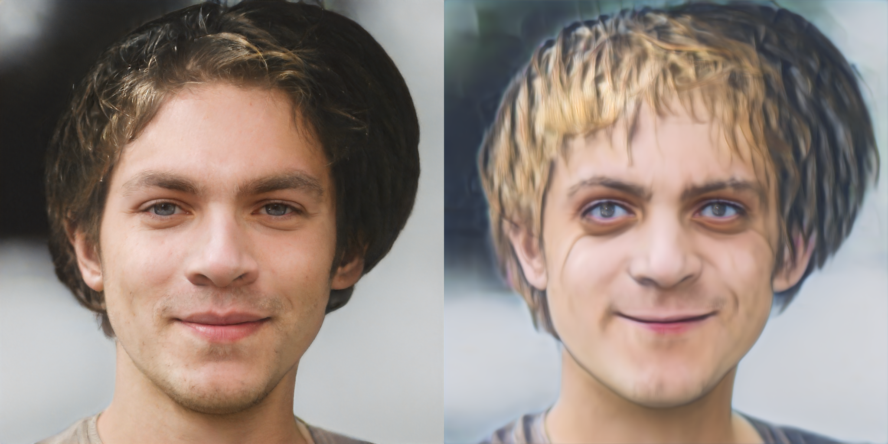
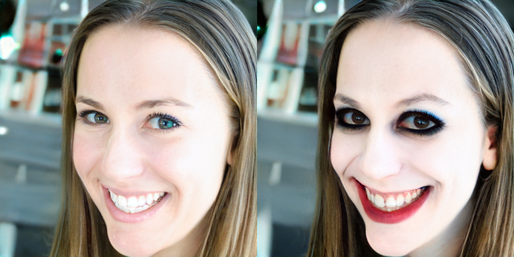
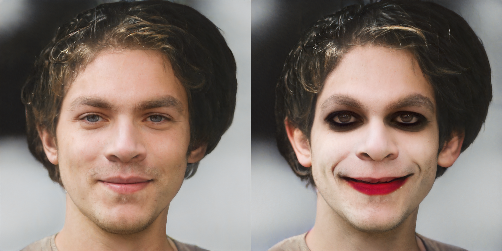

# StyleGAN-NADA-DLS
Реимплементация StyleGAN-NADA в качестве дипломного проекта для Deep Learning School (1-й семестр, весна 2025).
https://colab.research.google.com/drive/1UUAuVIstGxMJr44uyVV8E8bj7F5TtZyC?usp=sharing

Данный проект - моя реимплементация сети StyleGAN-NADA для изменения картинок в заданном пользователем направлении. Поддерживается только редактирование лиц, т.к. модель предобучена на датасете лиц FFHQ. Ссылка на оригинальную статью 2021 года: https://arxiv.org/abs/2108.00946.
Общий принцип действия сети: используют два предобученных генератора, один из которых сохраняют неизменным, а другой обучают изменять картинку, чтобы сделать ее похожей на целевой промпт.

  

Основные новшества статьи:
- использование в качестве лосса не просто косинусного расстояния между вектором изменяемой картинки и вектором целевого промпта, но косинусного расстояния между векторами от исходного промпта к целевому (ΔT) и от исходной картинки к желаемой (ΔI) в пространстве CLIP (т.н. направленный лосс), картинка слева
- обучение не всех слоев генератора, а только тех, которые наиболее сильно влияют на результирующую картинку, такие слои определяют по значению градиента для их параметров (loss feedback), картинка справа

  
  

Примеры работы (слева адаптация сгенерированной картинки, справа - инвертированного реального фото, взятого из фотостока, над картинками - использованные промпты):
- photo -> sketch

  
  

- photo -> anime

  
  

- human -> Joker

  
  

- human -> Nicolas Cage

  
  

